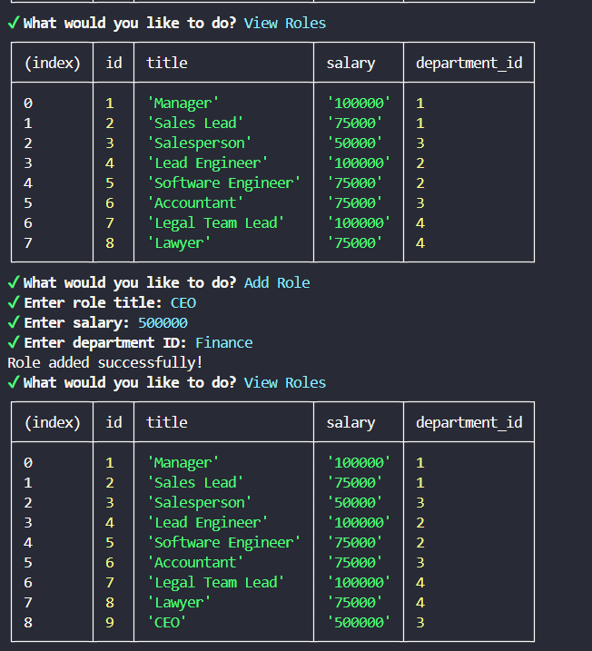

# Title

<h1>Employee Records</h1>

## Table of Contents

- [Description](#description)
- [Design](#design)
- [Install](#install)
- [Contributor](#contributor)
- [License](#license)
- [Questions](#questions)

## Description

   This project will run using CLI. The user will be able to manage the departments, role and employees in the company to keep everything organized.
   The user can also add, delete or update an employee or add or delete a role or deparment.

## Design

    This application is designed to help organize the company by keeping its employees, departments and roles in a database for ease of adding, updating or terminating employess. When done, scroll to Exit.

## Install

    This is a CLI app, so you will need to log into terminal and run npm start. 

## Contributor

    mvoidets 

## License

    This is not licensed  

### Questions

  If you have any questions, please contact me at: [mvoidets@yahoo.com] (mailto:mvoidets@yahoo.com).

  My GitHub profile is [mvoidets](https://guthub.com/mvoidets).

  Thank you for visiting my repository!
